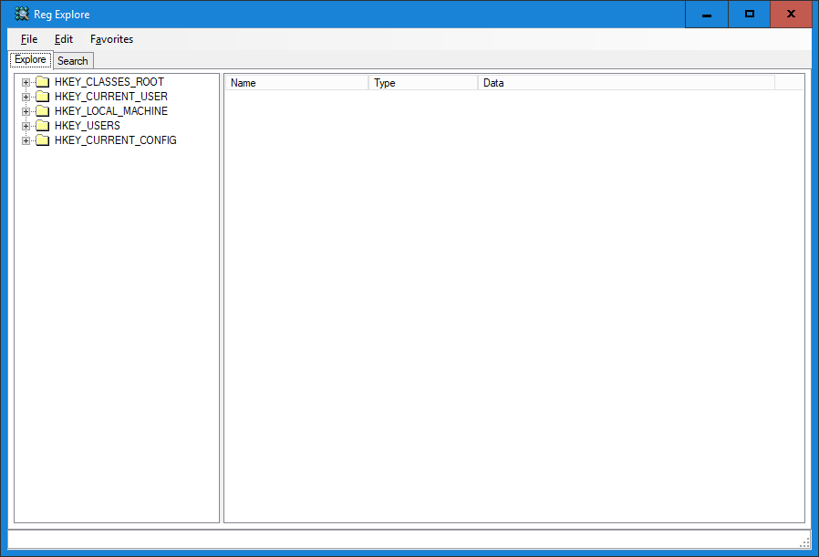

**Project Description**

RegExplore is a registry editor originally written by CrackSoft and released in 2008.

We have converted it into a library so that we can have it as a part of our Software [eWay-CRM](https://www.eway-crm.com).

# Changes

* Removed About menu
* Provided as an Assembly (DLL) not EXE
* Removed settings
* Possibility to open RegExplore on a specified path (JumpToKey)
* Removed Hex editor because of additional reference to Be.Windows.Forms.HexBox.dll
* Some GUI fixes

